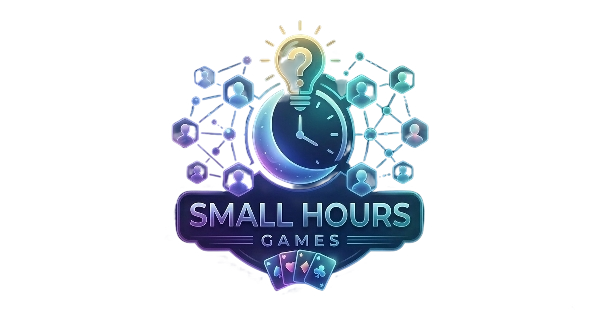

# Small Hours

Real-time multiplayer party games for late nights with friends. One shared screen on the TV, everyone plays from their phone — no app to download, no account needed.



## How It Works

1. **Host** opens the game on a shared screen (laptop, TV, etc.) and creates a room
2. **Players** join on their phones by visiting the URL and entering the 4-character room code
3. **Play** — the host picks a game and everyone plays together in real time

No app. No accounts. No installs. Just a browser.

## Games

| Game | Players | Description |
|------|---------|-------------|
| **Number Guess** | 2+ | Guess the secret number (1–100) with hot/cold feedback |
| **Quiz** | 2+ | Trivia questions from OpenTrivia DB with categories and powerups |
| **Spy** | 3+ | Social deduction — find the spy before they guess the secret word |
| **Shithead** | 2–4 | Classic card-shedding game, last player holding cards loses |
| **Gin Rummy** | 2 | Multi-hand card game with auto-computed melds and layoffs |

## Quick Start

**Requirements:** Node.js ≥ 22

```bash
# Install dependencies
npm install

# Start the server (port 3001)
npm start

# Or with auto-restart on file changes
npm run dev
```

Open [http://localhost:3001](http://localhost:3001) in your browser.

## Development

```bash
npm test            # run all tests (Vitest)
npm run test:watch  # watch mode
```

Tests live in `tests/` under subdirectories: `engine/`, `session/`, `integration/`, `fetcher/`, `frontend/`. The Shithead game test (`src/engine/games/shithead.test.js`) is co-located with its source as an exception.

## Architecture

The engine is a pure function — no I/O, no side effects:

```
(state, action) => { newState, events }
```

Three layers build on top of it:

```
src/
├── transport/       # Layer 1 — WebSocket server, HTTP routes, rate limiting
├── session/         # Layer 2 — Room management, player lifecycle, game registry
└── engine/          # Layer 3 — Pure game logic
    └── games/       # Individual game definitions (plain objects, not classes)
```

**Key decisions:**
- No 100ms tick loop — event-driven, broadcast on state change
- Games are plain objects `{ setup, actions, view, endIf }`, not class instances
- Transport-agnostic: the engine only speaks JSON in/out
- Players are ephemeral — no auth, no persistence

## Adding a New Game

Copy `src/engine/games/template.js` as a starting point:

```js
export default {
  setup({ players, config }) {
    // return initial state
  },
  actions: {
    myAction(state, { playerId, ...payload }) {
      // return { state, events }
    },
  },
  view(state, playerId) {
    // return what this player can see
  },
  endIf(state) {
    // return null if ongoing, { winner, scores } when done
  },
};
```

Then register it in two places:

1. `src/session/room.js` — add to `GAME_REGISTRY`
2. `src/engine/games/index.js` — add to re-exports

## Configuration

Copy `.env.example` to `.env` and set values as needed:

```
PORT=3001
DOMAIN=your-domain.com
GEMINI_API_KEY=your-key   # optional: enables TTS for quiz questions
```

Quiz questions are fetched from [OpenTrivia DB](https://opentdb.com/) and cached to disk under `data/questions/`. No API key needed for questions.

## Deployment

Docker Compose is the recommended way to deploy:

```bash
docker compose up -d
```

The `docker-compose.yml` uses `network_mode: host` with a health check on `/health`, resource limits (512 MB RAM, 1 CPU), and log rotation. Question cache and TTS audio are persisted via the `./data` volume mount.

To deploy updates:

```bash
git pull
docker compose up -d --build
```

## WebSocket Protocol

Clients connect to:
- `/ws/host/:code` — shared display screen
- `/ws/player/:code` — player phone controller

All messages are JSON with a `type` field. Game actions are sent as:

```json
{ "type": "GAME_ACTION", "action": { "type": "guess", "number": 42 } }
```

## Tech Stack

- **Runtime:** Node.js 22, JavaScript ESM (no TypeScript, no build step)
- **Server:** Express 5 + `ws` (WebSocket)
- **Frontend:** Vanilla browser JS, no framework, no bundler
- **Testing:** Vitest
- **Deployment:** Docker
