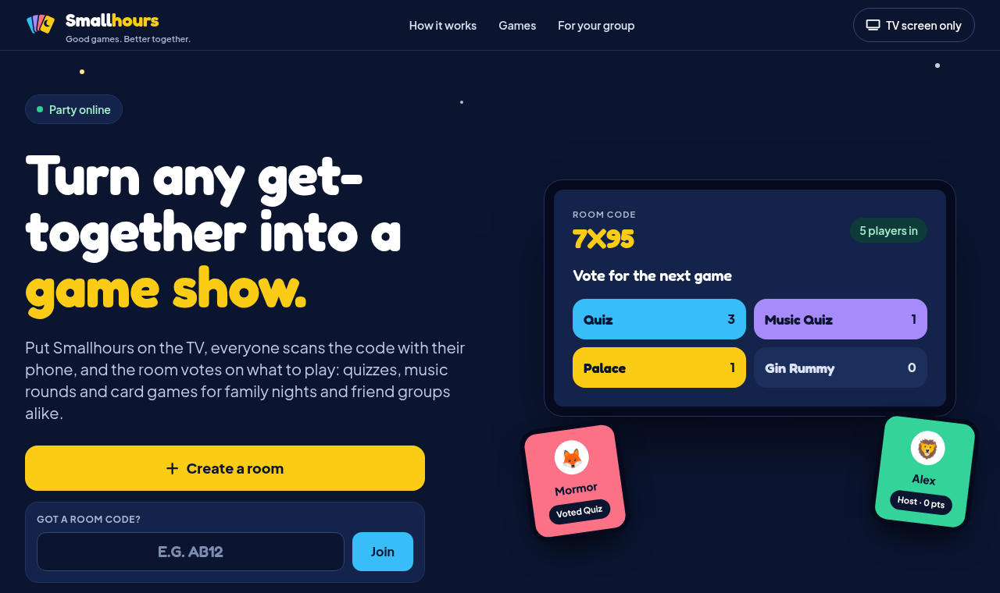

<h1 align="center">
  <picture>
    <source media="(prefers-color-scheme: dark)" srcset="public/images/smallhours-logo.svg">
    
  </picture>
</h1>

<p align="center"><strong>Good games. Better together.</strong></p>

<p align="center">
  Real-time party games for one TV and a few phones.<br>
  No accounts, no app to install, no missing controller.
</p>

<p align="center">
  <a href="package.json"></a>
  <a href="https://github.com/small-hours-games/small-hours/actions/workflows/docker.yml"></a>
  
</p>

<p align="center">
  
</p>

Smallhours turns a living room into a game show. One shared screen (a TV, a monitor, a projector) shows the questions, the board and the scores. Up to 20 players join from their phones with a four-character room code and play in the browser.

You host it yourself: on a laptop for one evening, or on a small home server that is always on.

## Quickstart

You need [Node.js](https://nodejs.org) 22 or later.

```bash
git clone https://github.com/small-hours-games/small-hours.git
cd small-hours
npm install
npm start
```

Check that it runs:

```bash
curl http://localhost:3001/health
```

Find the computer's address on your network (for example `192.168.1.50`), open `http://192.168.1.50:3001/tv` on the TV and scan the QR code with your phones. That's game night.

The TV and phones must be on the same network as the server. `localhost` on a phone means the phone itself. Trivia, Music Quiz previews and the fonts and libraries the screens load all need internet access.

## Games

| Game | Players | What you're getting into |
| --- | --- | --- |
| 🎯 **Quiz** | 1–20 | Vote for a category, race the timer, defend your trivia reputation. |
| 🎵 **Music Quiz** | 1–20 | Hear the clip, name the artist or song, try not to sing along. |
| 👑 **Palace** | 1–6 | Get rid of your cards, don't be the last one left. Alone? Play 1–4 AI characters: Nova-7, Glitch, Prof. Byte and Turbo. |
| ♠️ **Gin Rummy** | 1–2 | Build sets and runs, watch the discards, knock low. Alone? Play Nova-7, the AI. |
| 7️⃣ **Sjuan** | 2–8 | Build out from the sevens and be first out. |

AI seats are only added for a lone player and never earn session points.

## Features

- **Phones are the controllers.** Join with a code or a QR code, with nothing to install.
- **A host that talks.** Questions and reveals are read aloud on the TV, with a Gemini voice or the browser's own speech.
- **Votes, chat and avatars.** Vote for the next game and category, chat, and see who picked which answer.
- **Lobby music with a show.** Songs with a beat map light up the top bar with a dancing singer, fire over the logo and dancing mascots.
- **Play alone against AI.** Start Palace or Gin Rummy while the others arrive.
- **Survives a refresh.** A player who reloads within 30 seconds comes back as the same player.
- **Android TV app.** Opens the TV screen fullscreen and keeps the screen awake.

## How to play

1. Open `/tv` on the shared screen. It creates a room and shows a room code and a QR code. (Already have a room? Open `/host/CODE`.)
2. Players scan the QR code, or open the address on their phones and enter the code.
3. Everyone picks a name and an avatar and votes for the next game. The first player to join is the room admin.
4. The admin starts the game. Quiz first asks for a category; Music Quiz starts straight away.

The TV shows the questions, reveals, live scores and party chat. Phones hold the answers and the game controls.

## Run it on a server

For an always-on home server with Docker Compose v2 on a Linux host:

```bash
cp .env.example .env          # optional settings, see Configuration
docker compose build
docker compose up -d
curl http://localhost:3001/health
```

Compose uses host networking and keeps runtime data in `./data`, so rebuilding keeps caches and speech audio. After changing the code, run `docker compose build && docker compose up -d` again, then reload the TV and phones.

To deploy a published image from GitHub Container Registry instead, use [`update.sh`](update.sh): `./update.sh` for `latest`, or `./update.sh X.Y.Z` to deploy or roll back to a release.

The front page footer and `/health` show the running version and commit. Rooms, scores and reconnect identities live in memory, so a restart ends the current sessions and the TV page makes a new room.

## Make it yours

**Your own lobby music.** Drop audio files in `music/lobby/` and reload the TV page. With Docker the music is built into the image, so rebuild as well.

```bash
cp ~/Music/our-party-song.mp3 music/lobby/
```

**A topbar show for a song.** Make a beat map for a lobby track and list it in `TBS_SHOWS` in `public/js/topbar-show.js`.

```bash
pip install librosa
python3 scripts/song-beatmap.py music/lobby/our-party-song.mp3 --drop 20.0 --title "Our Party Song" \
  > public/shows/our-party-song.json
```

## Configuration

Copy `.env.example` to `.env` to change a setting. Nothing is required: the games play without any key.

| Setting | Where | Default | What it changes |
| --- | --- | --- | --- |
| `PORT` | `.env` | `3001` | HTTP and WebSocket port. |
| `DOMAIN` | `.env` | `localhost:3001` | Address used in room-created notification links. |
| `GEMINI_API_KEY` | `.env` | none | Turns on the Gemini game-show voice. Without it the TV uses the browser's speech where available. |
| `DISCORD_WEBHOOK_URL` | `.env` | none | Posts a Discord message when a room is created. |
| `IMAGE_TAG` | `.env` | `latest` | Which published Docker image `update.sh` and Compose use. |
| `showDelay` | TV address, `?showDelay=150` | `0` ms | Delays the topbar show to match a TV whose sound lags the picture. Saved on that TV. |
| Lobby music | `music/lobby/` | the tracks in the repo | Songs played on the TV in the lobby (`.mp3`, `.ogg`, `.m4a`, `.wav`). |
| Game music | `music/quiz-card/` | the tracks in the repo | Songs played during games that use music. |

Trivia comes from OpenTrivia DB and is cached in `data/`. Music Quiz uses Deezer playlists and previews; availability depends on that service.

## Troubleshooting

<details>
<summary><strong>The phone says "This site can't be reached."</strong></summary>

The phone is using `localhost` or a different network. Use the server computer's network address (`http://192.168.1.50:3001`), keep the phone on the same Wi-Fi, and allow port 3001 in the computer's firewall.
</details>

<details>
<summary><strong><code>Error: listen EADDRINUSE: address already in use :::3001</code></strong></summary>

Something else uses port 3001, often an earlier `npm start`. Stop it, or pick another port:

```bash
PORT=3002 npm start
```
</details>

<details>
<summary><strong>No sound on the TV.</strong></summary>

Browsers block audio until the page has been touched. Press a key or click once on the TV page, and check the Sound button in the top bar. For Music Quiz on a phone, tap "Tap to hear".
</details>

<details>
<summary><strong>A lobby song stops early, or the topbar show runs without music.</strong></summary>

The MP3 has no length header, so the browser guesses its length wrong. Rewrite the header without re-encoding:

```bash
ffmpeg -i song.mp3 -c copy -write_xing 1 song-fixed.mp3
```
</details>

<details>
<summary><strong><code>Failed to fetch questions</code> when a quiz starts.</strong></summary>

The server cannot reach OpenTrivia DB. Check the server's internet connection; categories already cached in `data/` still work.
</details>

## Under the hood

JavaScript end to end: **Node.js, Express and WebSockets** on the server; plain HTML, CSS and browser JavaScript on the screens, with no frontend build step. The game engine is a pure function, `(state, action) → { newState, events }`.

| Folder | What lives there |
| --- | --- |
| `src/transport/` | HTTP routes, WebSocket messages, rate limits, broadcasts. |
| `src/session/` | Rooms, players, lobby votes, game lifecycle. |
| `src/engine/` | Game rules, actions, scoring, private player views. |
| `games/` | One folder per game, found by the server at startup. |
| `public/` | The TV, phone and landing pages and shared assets. |
| `src/fetcher/` | Trivia, music, caching and speech. |
| `tests/` | Engine, session, transport, integration and frontend tests. |
| `android-tv/` | The Android TV app ([build instructions](android-tv/README.md)). |

[`AGENTS.md`](AGENTS.md) describes the conventions in more detail.

## Brand

The name is written **Smallhours**, as one word. The current assets are in [`public/images/`](public/images):

| File | Use it for |
| --- | --- |
| `smallhours-logo.svg` | The full logo on dark backgrounds. |
| `smallhours-logo-light.svg` | The full logo on light backgrounds. |
| `smallhours-mark.svg` | The card fan on its own. |
| `smallhours-icon.svg`, `smallhours-icon.png`, `smallhours-favicon.png` | App icon and favicon. |

The display font is Fredoka and the text font is Plus Jakarta Sans. The palette is night `#0b1530`, sun `#facc15`, sky `#38bdf8`, lilac `#a78bfa`, coral `#fb7185` and mint `#34d399`.

## Contributing

```bash
npm install
npm run dev     # restart the server when a file changes
npm test        # the full test suite (Vitest)
```

1. Branch from `main`.
2. Make the change with tests. To add a game, copy `games/_template/` and follow [`games/README.md`](games/README.md).
3. Raise the version once per push: `npm version patch --no-git-tag-version` for fixes, `minor` for features.
4. Open a pull request against `main`. CI runs the tests and checks that the version went up.

Keep game rules in the engine, private information (hands, answers) out of other players' views, and the next round easy to start.

## Roadmap

- **Next:** screens for Högt/Lågt and Uno, which already exist in the engine but are hidden from the lobby.
- **Out of scope today:** user accounts and saved profiles (rooms live in memory by design), and a native phone app (the browser is the controller).

Ideas and bugs go in [GitHub issues](https://github.com/small-hours-games/small-hours/issues).

## License

No open-source license has been chosen yet, so all rights are reserved by the authors. Ask before reusing the code. The card faces in `public/cards/faces/` are Chris Aguilar's Vector Playing Cards, under LGPL-3.0.

---

<p align="center">
  <br>
  <strong>Good games. Better together.</strong>
</p>
